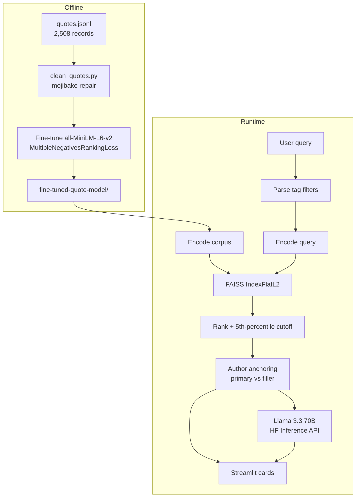

<h1 align="center">Commonplace — Semantic Quote Retrieval</h1>

<p align="center">
  A RAG system over 2,508 literary quotes: a fine-tuned sentence-transformer embeds the corpus,<br>
  FAISS ranks it by meaning, and an LLM reads the retrieved passage back as prose.
</p>

<p align="center">
  
  
  
  
  
  
  
  <br>
  <a href="https://github.com/VishnujanNarayanan"></a>
  <a href="https://www.linkedin.com/in/vishnujan-narayanan"></a>
  <a href="https://substack.com/@vishnujannarayanan"></a>
</p>

<p align="center">
  🎯 <a href="#why-this-project-exists">Why</a> ·
  🧩 <a href="#architecture">Architecture</a> ·
  🧠 <a href="#design-decisions">Design Decisions</a> ·
  ⚡ <a href="#installation">Installation</a> ·
  🧑‍💻 <a href="#usage">Usage</a> ·
  ⚙️ <a href="#configuration">Configuration</a> ·
  ⚠️ <a href="#limitations">Limitations</a>
</p>

---

## Why this project exists

Quotation collections are searched by keyword, which fails at the thing people actually want:
finding a passage that expresses an idea they can only describe loosely. Searching for
"courage in the face of fear" returns nothing useful if no quote contains those words.

This project makes the anthology searchable by meaning. Every quote is embedded by a
sentence-transformer fine-tuned on this specific corpus, indexed in FAISS, and ranked by vector
distance against the query. A language model then reads the retrieved set back as a short
passage, grounded strictly in what was retrieved.

## Features

- **Semantic search** over 2,508 quotes by L2 distance in embedding space.
- **Domain fine-tuning** — `all-MiniLM-L6-v2` retrained on (quote, `author – tags`) pairs so
  the embedding space encodes authorship and theme, not just surface wording.
- **Author anchoring** — pin results to one author; slots the author cannot fill on-topic are
  backfilled with related quotes from others, visually marked as fillers.
- **Percentile relevance cutoff** — a quote counts as on-topic if it lands in the closest 5% of
  the corpus *for that query*, rather than against a fixed distance threshold.
- **Tag filtering** parsed out of natural language (`tagged with both 'love' and 'life'`).
- **Grounded synthesis** — Llama 3.3 70B Instruct via the Hugging Face Inference API,
  instructed to use only the retrieved quotes.
- **Corpus repair tool** — `clean_quotes.py` reverses the cp1252/UTF-8 mojibake in the scrape,
  with assertions that refuse to write if any record would be lost.

## Architecture



## Design Decisions

**Fine-tuning targets metadata, not paraphrase.** Training pairs are `(quote, "author – tags")`
under `MultipleNegativesRankingLoss`. This pulls a quote's embedding toward a description of who
wrote it and what it is about, which is what the search box is actually asked for. A generic
paraphrase objective would not have produced that.

**A fixed distance threshold cannot work.** The best match for `"courage in the face of fear"`
sits at L2 ≈ 0.39; for `"love"` the best match is ≈ 0.99. Any constant cutoff either rejects
every result for broad queries or accepts everything for narrow ones. Relevance is therefore
defined relative to the distance distribution of the current query — the closest
`RELEVANCE_PCT = 5.0` percent of the corpus.

**Fillers are shown, not hidden.** When an author has too few on-topic quotes, the remaining
slots are filled from other authors and flagged `is_filler`. The alternative — silently
returning fewer results — hides why the query underdelivered.

**Author is a separate field, not parsed from the query.** Free-text author parsing was
unreliable against 2,500 authors with inconsistent trailing punctuation. The picker uses
`author_key` (trailing commas stripped) and orders authors by quote count.

**The index is rebuilt at startup, not loaded.** `load_model_and_index()` re-encodes the corpus
under `@st.cache_resource`. The checked-in `quote_index.faiss` is an artefact of the notebook;
the app does not read it.

## Project Structure

```
Quotes_Retrieval/
├── quotes_retrieval.ipynb          # Data prep, fine-tuning, FAISS build, LLM QA prototype
├── app/
│   ├── app.py                      # Streamlit application (retrieval + synthesis + UI)
│   ├── clean_quotes.py             # Mojibake repair for quotes.jsonl (dry-run by default)
│   ├── quotes.jsonl                # Working corpus, 2,508 records
│   ├── quotes.jsonl.bak            # Pre-repair backup written by clean_quotes.py
│   ├── quote_index.faiss           # Serialised index from the notebook
│   ├── fine-tuned-quote-model/     # Saved SentenceTransformer (safetensors, tokenizer, pooling)
│   └── .streamlit/
│       ├── config.toml             # Dark theme matching the app's palette
│       └── secrets.toml            # HF_TOKEN (not committed with a real value)
└── Data/
    └── quotes_dataset.csv          # CSV export of the raw corpus
```

## Installation

Clone the repository:

```bash
git clone https://github.com/VishnujanNarayanan/Quotes_Retrieval.git
cd Quotes_Retrieval
```

Create a virtual environment:

```bash
python -m venv .venv
source .venv/bin/activate      # Linux / macOS
.venv\Scripts\activate         # Windows
```

Install dependencies. There is no `requirements.txt` in the repository yet, so install the
imports the app uses directly:

```bash
pip install streamlit sentence-transformers faiss-cpu pandas numpy huggingface-hub ftfy
```

The fine-tuned model is committed under `app/fine-tuned-quote-model/` (~91 MB), so no training
is required to run the app.

## Usage

### Run the app

The model path in `app.py` is relative, so the app must be started from inside `app/`:

```bash
cd app
streamlit run app.py
```

First load encodes all 2,508 quotes and builds the index; subsequent interactions are cached.

### Search modes

| Input | Behaviour |
|---|---|
| Query only | Top-`k` quotes across the whole corpus, ranked by L2 distance |
| Author only | Quotes by that author, backfilled from the author's centroid if short |
| Query + author | On-topic quotes by that author first, then flagged fillers from others |
| `tagged with both 'love' and 'life'` | Restricts the candidate pool to quotes carrying both tags |
| `tagged 'courage'` | Restricts to a single tag |

Tag phrases are stripped from the text before embedding, so the filter and the semantic query
do not interfere.

### Repair the corpus

```bash
cd app
python clean_quotes.py            # dry run — reports what would change
python clean_quotes.py --apply    # backs up to quotes.jsonl.bak, then rewrites
```

The script asserts that record count, tag counts, field sets, and quote non-emptiness are all
preserved, and re-reads the file after writing to confirm it round-trips.

## Configuration

| Setting | Where | Default |
|---|---|---|
| `HF_TOKEN` | `app/.streamlit/secrets.toml`, else the `HF_TOKEN` env var, else a password field in the UI | none |
| `SUMMARY_MODEL` | `app/app.py` | `meta-llama/Llama-3.3-70B-Instruct` |
| `RELEVANCE_PCT` | `app/app.py` | `5.0` |
| Model directory | `app/app.py` | `fine-tuned-quote-model` |
| Corpus path | `app/app.py` | `quotes.jsonl` |
| Theme | `app/.streamlit/config.toml` | dark, brass `#C8A24A` on ink `#12161F` |

Without a token the app still retrieves and displays quotes; only the synthesis panel is
disabled.

## Example Workflow

1. Start the app from `app/`.
2. Enter `courage in the face of fear` and leave the author as **Any author**.
3. Five cards render, each showing rank, quote, author, tags, and a gilt rule whose fill is
   `1 - L2/1.5` clamped to `[0, 1]`, with the raw L2 distance printed alongside.
4. Set the author picker to a specific author and search again. Quotes by that author that fall
   inside the 5th-percentile cutoff appear first; the rest of the slots appear under
   *Related, from other authors*.
5. With a token configured, the right column asks Llama 3.3 to explain the common theme across
   the retrieved quotes in three to four sentences, citing authors by name.

## Dependencies

| Package | Why |
|---|---|
| `sentence-transformers` | Fine-tuning and encoding; `MultipleNegativesRankingLoss` |
| `faiss-cpu` | Exact L2 nearest-neighbour search over the corpus |
| `torch` | Backend for the transformer encoder |
| `streamlit` | UI, caching (`@st.cache_resource`), and secrets handling |
| `huggingface-hub` | `InferenceClient` for the hosted Llama 3.3 summarisation |
| `pandas` / `numpy` | JSONL loading and embedding arithmetic |
| `ftfy` | Reversing the cp1252/UTF-8 mojibake in the scraped corpus |

## Training

Reproduced in `quotes_retrieval.ipynb`:

| Setting | Value |
|---|---|
| Base model | `sentence-transformers/all-MiniLM-L6-v2` |
| Objective | `MultipleNegativesRankingLoss` |
| Pairs | `(quote, "author – comma-joined tags")` |
| Batch size | 16 |
| Epochs | 1 |
| Max sequence length | 256 |
| Similarity function | cosine (as saved), L2 at query time |

## Limitations

- **No retrieval evaluation.** The system is not scored with RAGAS, Quotient, or Phoenix, so
  retrieval quality is assessed only by inspection.
- **No `requirements.txt`.** Dependency versions are not pinned in the repository.
- **`IndexFlatL2` is a brute-force scan.** Fine at 2,508 vectors; it does not scale.
- **The corpus is re-encoded on every cold start** rather than loading the committed
  `quote_index.faiss`, which makes first paint slow.
- **The full corpus is searched with `k = len(quotes_data)`** on every query to compute the
  percentile cutoff — correct, but wasteful.
- **The notebook still reads from an absolute Windows path** and will not run unedited elsewhere.
- **`app/.streamlit/secrets.toml` is tracked**, so care is needed not to commit a live token.
- **Synthesis depends on a third-party API.** No token means no synthesis, and failures surface
  as an inline error.
- **The 91 MB model is committed to git**, which makes cloning heavy.

## Roadmap

- Add `requirements.txt` with pinned versions.
- Load the persisted FAISS index instead of re-encoding at startup.
- Add a retrieval evaluation harness with a labelled query set.
- Restrict the FAISS search width instead of scanning the corpus for the percentile cutoff.
- Move `secrets.toml` out of version control and document `.env`-based configuration.
- Parameterise the notebook's dataset path.

## License

Released under the MIT License — free to use, modify and distribute, with attribution and
without warranty.

## Acknowledgements

Corpus derived from the [Abirate/english_quotes](https://huggingface.co/datasets/Abirate/english_quotes)
dataset. Embeddings built on `sentence-transformers/all-MiniLM-L6-v2`.

## Author

<p align="center">
  <strong>Vishnujan Narayanan</strong>
</p>

<p align="center">
  <a href="https://github.com/VishnujanNarayanan"></a>
  <a href="https://www.linkedin.com/in/vishnujan-narayanan"></a>
  <a href="https://substack.com/@vishnujannarayanan"></a>
</p>
