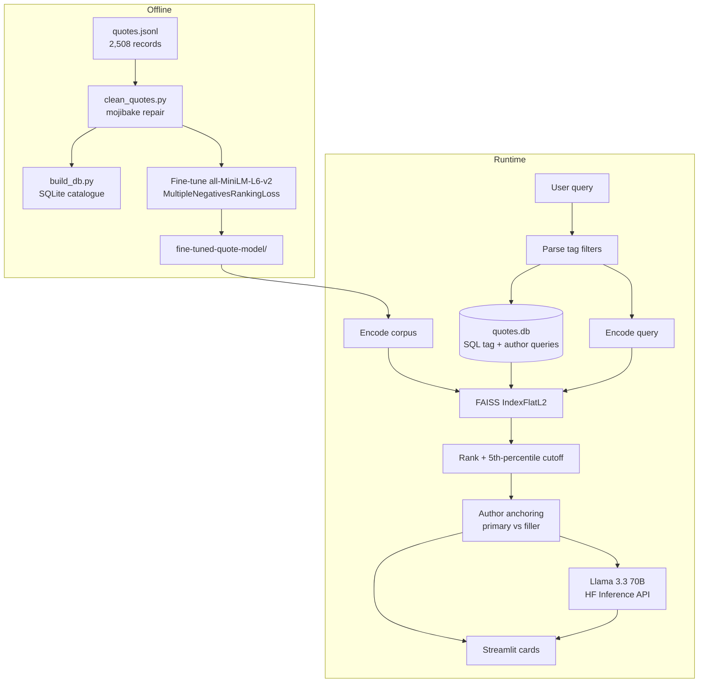

<h1 align="center">Commonplace — Semantic Quote Retrieval</h1>

<p align="center">
  A RAG system over 2,508 literary quotes: a fine-tuned sentence-transformer embeds the corpus,<br>
  FAISS ranks it by meaning, and an LLM reads the retrieved passage back as prose.
</p>

<p align="center">
  <a href="https://quotes-demo.streamlit.app/"></a>
</p>

<p align="center">
  <sub>Free tier — the app sleeps when idle and re-encodes the corpus on a cold start, so first paint can take a minute.</sub>
</p>

<p align="center">
  
  
  
  
  
  
  
  
  
  
  <br>
  <a href="https://vishnujan-narayanan.vercel.app/"></a>
  <a href="https://github.com/VishnujanNarayanan"></a>
  <a href="https://www.linkedin.com/in/vishnujan-narayanan"></a>
  <a href="https://substack.com/@vishnujannarayanan"></a>
</p>

<p align="center">
  🎯 <a href="#why-this-project-exists">Why</a> ·
  🧩 <a href="#architecture">Architecture</a> ·
  🧠 <a href="#design-decisions">Design Decisions</a> ·
  ⚡ <a href="#installation">Installation</a> ·
  🧑‍💻 <a href="#usage">Usage</a> ·
  ✅ <a href="#testing-and-evaluation">Testing & Evaluation</a> ·
  ⚙️ <a href="#configuration">Configuration</a> ·
  ⚠️ <a href="#limitations">Limitations</a>
</p>

---

## Why this project exists

Quotation collections are searched by keyword, which fails at the thing people actually want:
finding a passage that expresses an idea they can only describe loosely. Searching for
"courage in the face of fear" returns nothing useful if no quote contains those words.

This project makes the anthology searchable by meaning. Every quote is embedded by a
sentence-transformer fine-tuned on this specific corpus, indexed in FAISS, and ranked by vector
distance against the query. A language model then reads the retrieved set back as a short
passage, grounded strictly in what was retrieved.

## Features

- **Semantic search** over 2,508 quotes by L2 distance in embedding space.
- **Domain fine-tuning** — `all-MiniLM-L6-v2` retrained on (quote, `author – tags`) pairs so
  the embedding space encodes authorship and theme, not just surface wording.
- **Author anchoring** — pin results to one author; slots the author cannot fill on-topic are
  backfilled with related quotes from others, visually marked as fillers.
- **Percentile relevance cutoff** — a quote counts as on-topic if it lands in the closest 5% of
  the corpus *for that query*, rather than against a fixed distance threshold.
- **Tag filtering** parsed out of natural language (`tagged with both 'love' and 'life'`).
- **Grounded synthesis** — Llama 3.3 70B Instruct via the Hugging Face Inference API,
  instructed to use only the retrieved quotes.
- **Corpus repair tool** — `clean_quotes.py` reverses the cp1252/UTF-8 mojibake in the scrape,
  with assertions that refuse to write if any record would be lost.
- **SQLite catalogue** — the author picker and the tag intersection are SQL queries against
  `quotes.db`, not Python scans of the whole corpus on every keystroke. The statements live in
  `app/queries.sql` so they can be read and run on their own.
- **Retrieval evaluation** — `eval/baseline.py` scores the fine-tuned encoder against a
  scikit-learn TF-IDF baseline over a labelled query set, so "the fine-tune helped" is a
  measurement rather than an assumption.

## Architecture



## Design Decisions

**Fine-tuning targets metadata, not paraphrase.** Training pairs are `(quote, "author – tags")`
under `MultipleNegativesRankingLoss`. This pulls a quote's embedding toward a description of who
wrote it and what it is about, which is what the search box is actually asked for. A generic
paraphrase objective would not have produced that.

**A fixed distance threshold cannot work.** The best match for `"courage in the face of fear"`
sits at L2 ≈ 0.39; for `"love"` the best match is ≈ 0.99. Any constant cutoff either rejects
every result for broad queries or accepts everything for narrow ones. Relevance is therefore
defined relative to the distance distribution of the current query — the closest
`RELEVANCE_PCT = 5.0` percent of the corpus.

**Fillers are shown, not hidden.** When an author has too few on-topic quotes, the remaining
slots are filled from other authors and flagged `is_filler`. The alternative — silently
returning fewer results — hides why the query underdelivered.

**Author is a separate field, not parsed from the query.** Free-text author parsing was
unreliable against 2,500 authors with inconsistent trailing punctuation. The picker uses
`author_key` (trailing commas stripped) and orders authors by quote count.

**Set operations belong in SQL, vector operations in FAISS.** Counting quotes per author and
intersecting two tag filters were Python loops over the whole corpus on every interaction. They
are one indexed query each against `quotes.db` now. The join between the two halves is
`quotes.ordinal` — a record's position in `quotes.jsonl`, which is also its row in the embedding
matrix — so a SQL filter can hand FAISS a candidate set directly. The vector search stays in
FAISS, where it belongs; SQLite never sees an embedding.

**Ranking is separated from the UI so it can be tested.** `retrieval.py` imports no Streamlit
and no model: it takes a float32 matrix and a callable that embeds text. `app.py` supplies the
real encoder, the tests supply six hand-placed vectors. Without that split, asserting anything
about the percentile cutoff meant loading 91 MB of weights and starting a Streamlit session.

**The corpus embeddings are cached, and the cache is fingerprinted.** Encoding all 2,508 quotes
dominated a cold start — 22.8s locally, worse on a free host. `quote_embeddings.npy` is committed
and loaded instead, which takes 0.08s including building the flat index.

The fingerprint is the load-bearing part. The notebook left behind a `quote_index.faiss` with
exactly the right shape — 2,508 vectors of 384 dimensions — whose contents disagreed with the
current corpus by up to 8.9e-4, because the notebook lowercased its text and the corpus has since
been mojibake-repaired. Loading a cache because it *looks* right silently degrades every search.
`embed_cache` records a SHA-256 of the corpus text and of the model weights, and refuses itself
when either has moved; the app then re-encodes and rewrites. That stale index has been deleted.

## Project Structure

```
Quotes_Retrieval/
├── quotes_retrieval.ipynb          # Data prep, fine-tuning, FAISS build, LLM QA prototype
├── requirements.txt                # Runtime deps, pinned
├── requirements-dev.txt            # Test/CI deps — no torch, no sentence-transformers
├── Dockerfile                      # Reproducible runtime, model baked in
├── ruff.toml                       # Lint config
├── app/
│   ├── app.py                      # Streamlit application (UI + synthesis + wiring)
│   ├── retrieval.py                # Ranking rules — no Streamlit, no model, unit-tested
│   ├── db.py                       # SQLite access; loads the statements in queries.sql
│   ├── schema.sql                  # Tables and indexes for quotes.db
│   ├── queries.sql                 # Named, parameterised queries the app runs
│   ├── build_db.py                 # Builds quotes.db from quotes.jsonl
│   ├── clean_quotes.py             # Mojibake repair for quotes.jsonl (dry-run by default)
│   ├── quotes.jsonl                # Working corpus, 2,508 records
│   ├── quotes.db                   # Generated SQLite catalogue (gitignored)
│   ├── quote_embeddings.npy        # Cached corpus vectors — skips encoding at startup
│   ├── quote_embeddings.json       # Fingerprint of the corpus + model the cache came from
│   ├── embed_cache.py              # Loads the cache, or refuses it when it is stale
│   ├── build_embeddings.py         # Regenerates the cache
│   ├── fine-tuned-quote-model/     # Saved SentenceTransformer (safetensors, tokenizer, pooling)
│   └── .streamlit/
│       ├── config.toml             # Dark theme matching the app's palette
│       └── secrets.toml            # HF_TOKEN (not committed with a real value)
├── tests/                          # pytest suite over retrieval, SQL and corpus repair
├── eval/
│   ├── baseline.py                 # Fine-tuned encoder vs a TF-IDF baseline
│   └── queries.json                # Labelled query set, derived from the corpus tags
├── .github/workflows/ci.yml        # ruff + pytest on ubuntu-latest
└── Data/
    └── quotes_dataset.csv          # CSV export of the raw corpus
```


## Installation

Clone the repository:

```bash
git clone https://github.com/VishnujanNarayanan/Quotes_Retrieval.git
cd Quotes_Retrieval
```

Create a virtual environment:

```bash
python -m venv .venv
source .venv/bin/activate      # Linux / macOS
.venv\Scripts\activate         # Windows
```

Install dependencies:

```bash
pip install -r requirements.txt
```

To work on the retrieval rules, the SQL layer or the corpus repair without pulling PyTorch,
install the light set instead — it is what CI uses and it runs the whole test suite:

```bash
pip install -r requirements-dev.txt
```

The fine-tuned model is committed under `app/fine-tuned-quote-model/` (~91 MB), so no training
is required to run the app.

## Usage

### Use the hosted app

The deployed instance is at **<https://quotes-demo.streamlit.app/>** — no install required.
It runs on a free tier, so it sleeps when idle and re-encodes all 2,508 quotes on a cold
start; give it a minute on first load.

### Run it locally

```bash
streamlit run app/app.py
```

Paths resolve relative to `app.py` itself, so it runs from anywhere — including a hosted
runner that starts from the repository root.

First load reads the cached corpus vectors and builds the FAISS index; it also creates
`quotes.db` if it is missing. If the cache is absent or its fingerprint no longer matches the
corpus and model, the app encodes in-process and rewrites it — correct either way, just slower.

### Run it in Docker

```bash
docker build -t commonplace .
docker run --rm -p 8501:8501 -e HF_TOKEN=hf_xxx commonplace
```

The image bakes in the fine-tuned model and builds the SQLite catalogue at build time, so the
container starts and searches with no network access. Drop `-e HF_TOKEN` to run retrieval-only.

### Rebuild the embedding cache

After changing the corpus or retraining the model:

```bash
python app/build_embeddings.py
```

Forgetting to is safe — the fingerprint stops the app trusting a stale cache.

### Rebuild the SQLite catalogue

The app does this itself when `quotes.db` is absent. Rebuild it deliberately after repairing
the corpus:

```bash
python app/build_db.py
```

The queries it exposes are in `app/queries.sql`, so they can be run directly:

```bash
sqlite3 app/quotes.db "SELECT tag, COUNT(*) n FROM quote_tags GROUP BY 1 ORDER BY n DESC LIMIT 10;"
```

### Search modes

| Input | Behaviour |
|---|---|
| Query only | Top-`k` quotes across the whole corpus, ranked by L2 distance |
| Author only | Quotes by that author, backfilled from the author's centroid if short |
| Query + author | On-topic quotes by that author first, then flagged fillers from others |
| `tagged with both 'love' and 'life'` | Restricts the candidate pool to quotes carrying both tags |
| `tagged 'courage'` | Restricts to a single tag |

Tag phrases are stripped from the text before embedding, so the filter and the semantic query
do not interfere.

### Repair the corpus

```bash
cd app
python clean_quotes.py            # dry run — reports what would change
python clean_quotes.py --apply    # backs up to quotes.jsonl.bak, then rewrites
```

The script asserts that record count, tag counts, field sets, and quote non-emptiness are all
preserved, and re-reads the file after writing to confirm it round-trips.

## Testing and Evaluation

### Tests

```bash
pytest tests -q          # 60 tests, ~1s
ruff check .
```

`app/retrieval.py`, `app/db.py` and `app/clean_quotes.py` hold no Streamlit and no model code,
so the suite runs on `requirements-dev.txt` alone — no PyTorch download, no 91 MB model load.
The fixtures place six records at hand-chosen coordinates, so every ranking assertion is a
statement about the retrieval rules rather than about the encoder.

What it covers: tag-filter parsing and stripping · distance ranking and `top_k` · author
anchoring, the percentile cutoff and filler backfill · the author-only centroid branch · the
SQL author catalogue and tag intersection · ordinal-to-embedding-row correspondence · mojibake
repair, the destroyed-byte mapping and the round-trip guarantees.

### Retrieval evaluation

```bash
python eval/baseline.py              # both systems
python eval/baseline.py --tfidf-only # skip the encoder, needs no torch
```

`eval/queries.json` holds 12 labelled queries; a retrieval counts as a hit when it returns a
quote by an author who wrote something carrying the query's tag. Labels come from the corpus's
own tags rather than from guesswork, so the set is reproducible.

| System | recall@1 | recall@3 | recall@5 | recall@10 |
|---|---|---|---|---|
| TF-IDF baseline (scikit-learn) | 0.50 | 0.75 | 0.83 | 0.92 |
| Fine-tuned sentence-transformer | 0.75 | 1.00 | 1.00 | 1.00 |

The baseline is the point: fine-tuning is only worth its cost if it beats keyword matching over
the same corpus, and nothing in the repository previously established that it did.

This is a sanity check, not a benchmark. Twelve tag-derived queries catch a fine-tune that made
retrieval worse; they do not measure how good the ranking is in absolute terms.

## Configuration

| Setting | Where | Default |
|---|---|---|
| `HF_TOKEN` | `app/.streamlit/secrets.toml`, else the `HF_TOKEN` env var, else a password field in the UI | none |
| `SUMMARY_MODEL` | `app/app.py` | `meta-llama/Llama-3.3-70B-Instruct` |
| `RELEVANCE_PCT` | `app/app.py` | `5.0` |
| Model directory | `app/app.py` | `fine-tuned-quote-model` |
| Corpus path | `app/app.py` | `quotes.jsonl`, resolved next to `app.py` |
| SQLite path | `app/db.py` | `quotes.db`, resolved next to `db.py` |
| Theme | `app/.streamlit/config.toml` | dark, brass `#C8A24A` on ink `#12161F` |

Without a token the app still retrieves and displays quotes; only the synthesis panel is
disabled.

## Example Workflow

1. Start the app from `app/`.
2. Enter `courage in the face of fear` and leave the author as **Any author**.
3. Five cards render, each showing rank, quote, author, tags, and a gilt rule whose fill is
   `1 - L2/1.5` clamped to `[0, 1]`, with the raw L2 distance printed alongside.
4. Set the author picker to a specific author and search again. Quotes by that author that fall
   inside the 5th-percentile cutoff appear first; the rest of the slots appear under
   *Related, from other authors*.
5. With a token configured, the right column asks Llama 3.3 to explain the common theme across
   the retrieved quotes in three to four sentences, citing authors by name.

## Dependencies

| Package | Why |
|---|---|
| `sentence-transformers` | Fine-tuning and encoding; `MultipleNegativesRankingLoss` |
| `faiss-cpu` | Exact L2 nearest-neighbour search over the corpus |
| `torch` | Backend for the transformer encoder |
| `streamlit` | UI, caching (`@st.cache_resource`), and secrets handling |
| `huggingface-hub` | `InferenceClient` for the hosted Llama 3.3 summarisation |
| `pandas` / `numpy` | JSONL loading and embedding arithmetic |
| `ftfy` | Reversing the cp1252/UTF-8 mojibake in the scraped corpus |
| `scikit-learn` | The TF-IDF retrieval baseline in `eval/baseline.py` |
| `sqlite3` (stdlib) | The author catalogue and tag intersection in `app/queries.sql` |
| `hashlib` (stdlib) | Fingerprinting the embedding cache against the corpus and model |
| `pytest`, `ruff` | Test suite and linting, run in CI on every push |

## Training

Reproduced in `quotes_retrieval.ipynb`:

| Setting | Value |
|---|---|
| Base model | `sentence-transformers/all-MiniLM-L6-v2` |
| Objective | `MultipleNegativesRankingLoss` |
| Pairs | `(quote, "author – comma-joined tags")` |
| Batch size | 16 |
| Epochs | 1 |
| Max sequence length | 256 |
| Similarity function | cosine (as saved), L2 at query time |

## Limitations

- **The evaluation is thin.** `eval/baseline.py` compares against a TF-IDF floor on 12
  tag-derived queries. That catches a regression; it is not RAGAS, Quotient or Phoenix, and the
  labels are coarse — any quote by a matching author counts as a hit.
- **`IndexFlatL2` is a brute-force scan.** Fine at 2,508 vectors; it does not scale.
- **The full corpus is searched with `k = len(quotes_data)`** on every query to compute the
  percentile cutoff — correct, but wasteful.
- **The notebook still reads from an absolute Windows path** and will not run unedited elsewhere.
- **A tag-only query with no author returns nothing.** `tagged 'courage'` on its own leaves no
  text to embed, so there is nothing to rank; the search-modes table above overstates it. Pair
  the tag with a query or an author.
- **The Docker image is unverified.** The `Dockerfile` is written against the pinned
  requirements but has not been built end to end on this machine.
- **`app/.streamlit/secrets.toml` is tracked**, so care is needed not to commit a live token.
- **Synthesis depends on a third-party API.** No token means no synthesis, and failures surface
  as an inline error.
- **The 91 MB model is committed to git**, which makes cloning heavy.

## Roadmap

- Restrict the FAISS search width instead of scanning the corpus for the percentile cutoff.
- Move `secrets.toml` out of version control and document `.env`-based configuration.
- Parameterise the notebook's dataset path.
- Widen the evaluation set and label it by relevance rather than by shared tag.

## License

Released under the MIT License — free to use, modify and distribute, with attribution and
without warranty.

## Acknowledgements

Corpus derived from the [Abirate/english_quotes](https://huggingface.co/datasets/Abirate/english_quotes)
dataset. Embeddings built on `sentence-transformers/all-MiniLM-L6-v2`.

## Author

<p align="center">
  <strong>Vishnujan Narayanan</strong>
</p>

<p align="center">
  <a href="https://vishnujan-narayanan.vercel.app/"></a>
  <a href="https://github.com/VishnujanNarayanan"></a>
  <a href="https://www.linkedin.com/in/vishnujan-narayanan"></a>
  <a href="https://substack.com/@vishnujannarayanan"></a>
</p>
